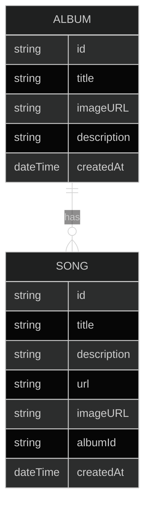

# Intro

This is a Website made for music upload/download along with albums.

## Stack used

- [NextJS](https://nextjs.org/)
- [Firebase](https://firebase.google.com/)

## Development

[Nix](https://nixos.org/manual/nix/stable/language/index.html) is used here for
providing the tests and development environment along with git's pre-commits.

### Stack used in development

- [Devenv](https://devenv.sh/)
- [Cachix Pre-commit-hooks](https://github.com/cachix/pre-commit-hooks.nix)
- [Hydra (CI/CD)](https://hydra.nixos.org/build/196107287/download/1/hydra/)
- [Firebase emulator suite](https://firebase.google.com/docs/emulator-suite)

### Database schema

The following diagram reflects the database schema:

Powered by [Vercel](https://vercel.com/).
