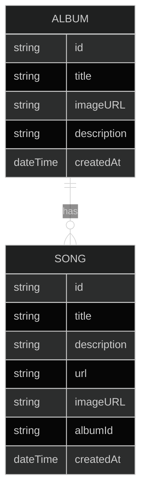

The following diagram reflects the database schema:

```mermaid
%%{init: {'theme':'dark'}}%%
erDiagram

ALBUM ||--o{ SONG : has

SONG {
    string id
    string title
    string description
    string url
    string imageURL
    string albumId
    dateTime createdAt
}

ALBUM {
    string id
    string title
    string imageURL
    string description
    dateTime createdAt
}
```
